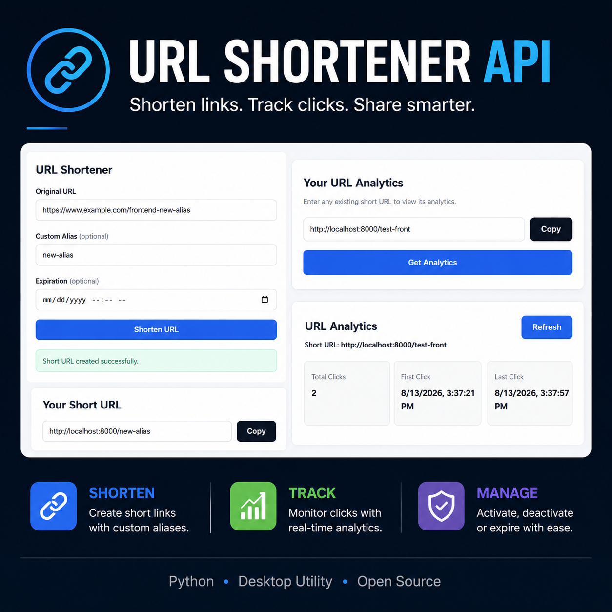
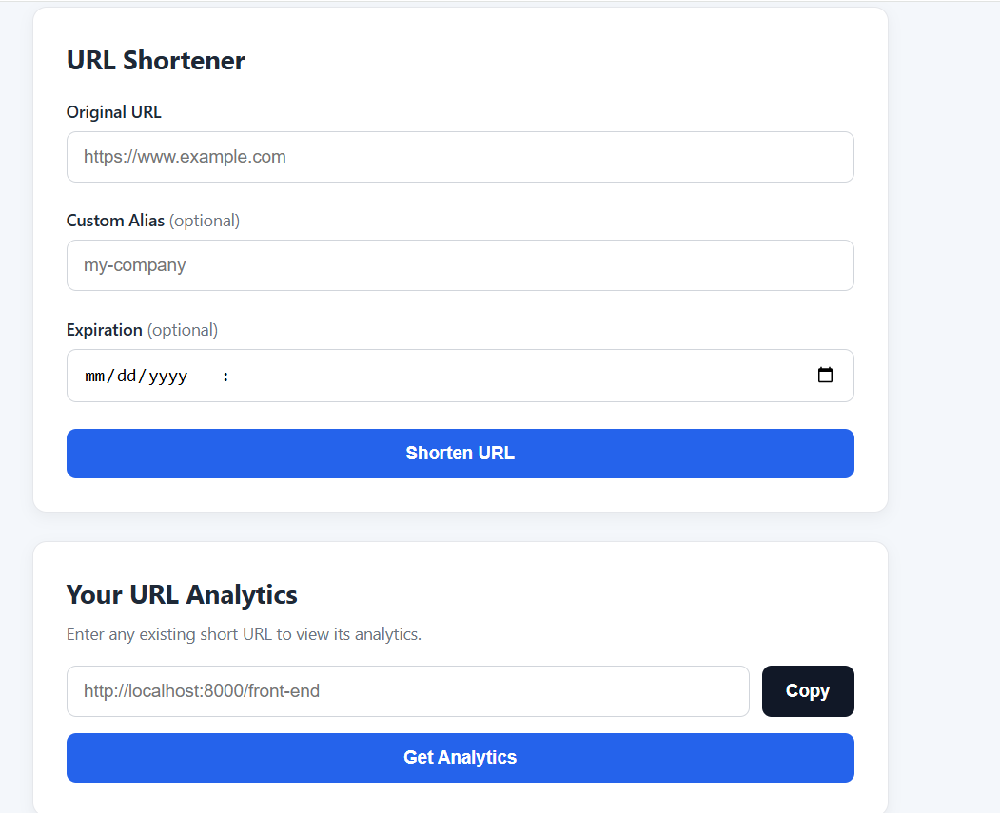
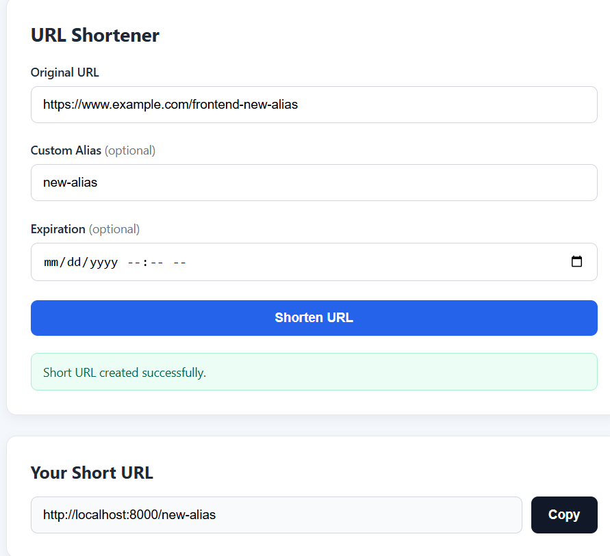
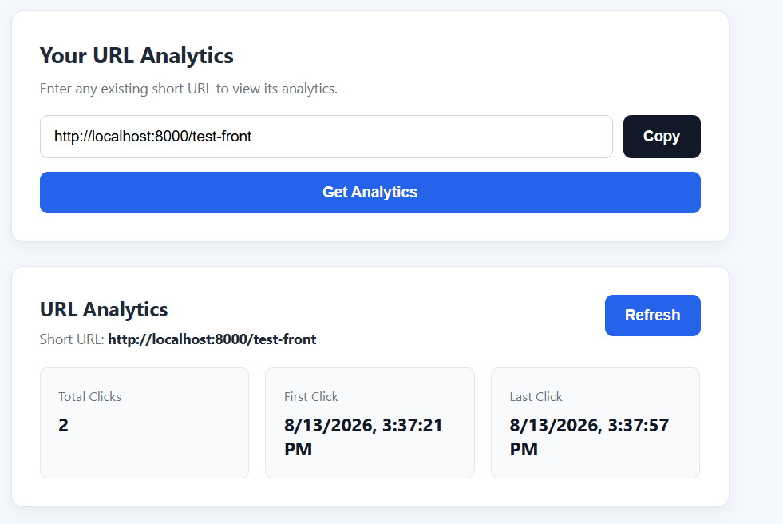
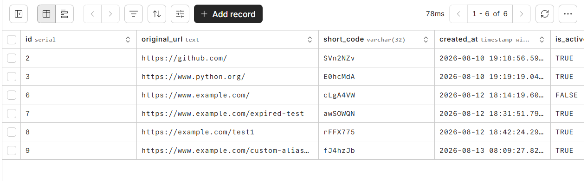
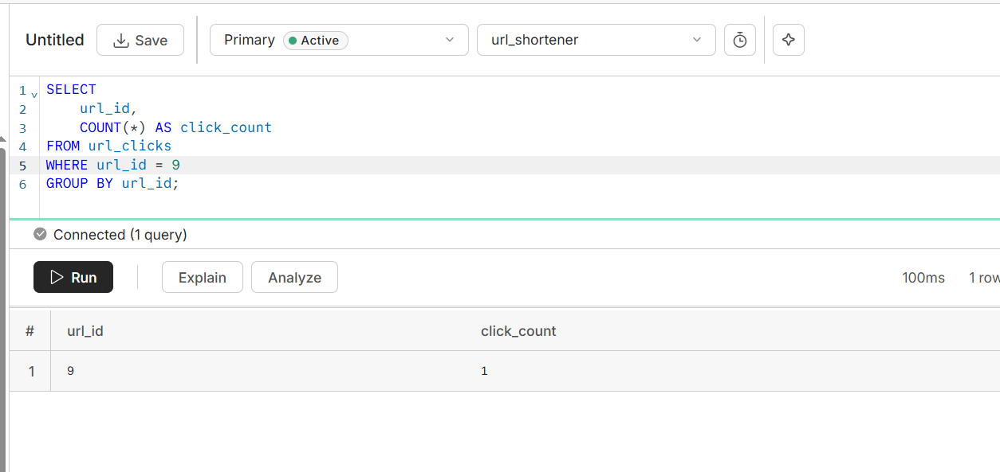
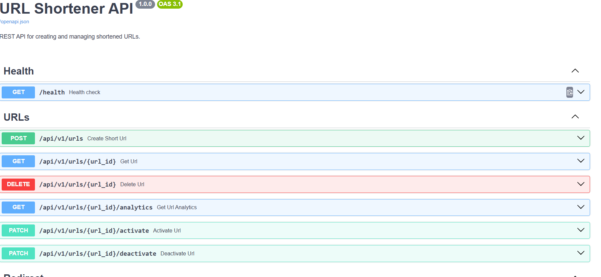
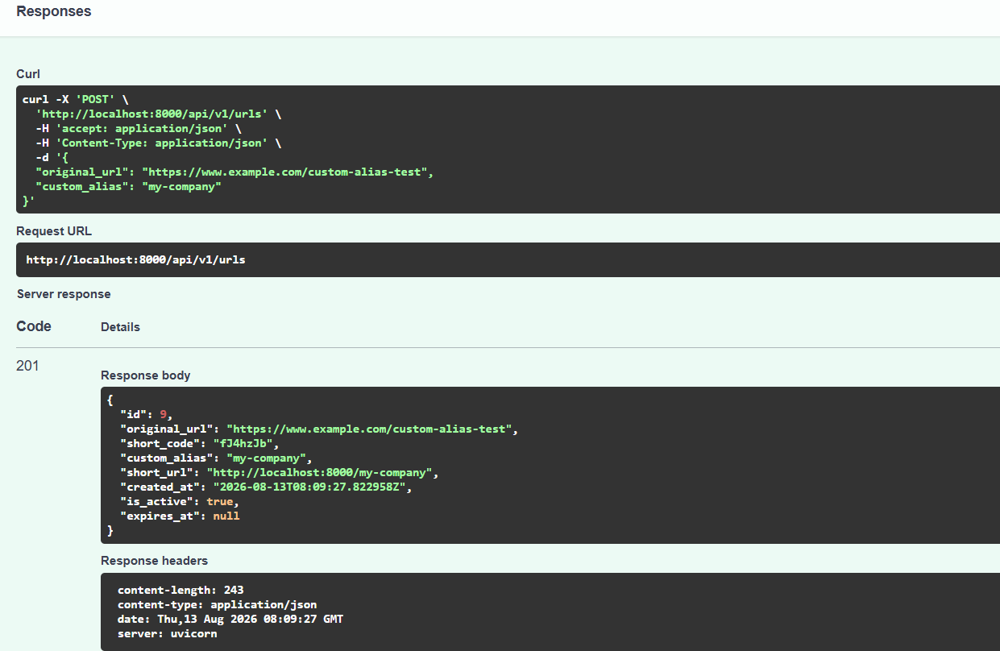
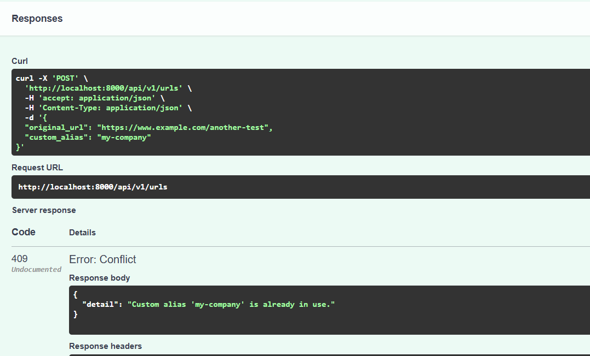

# URL Shortener API



> Project poster placeholder — `screenshots/poster.png`

---

## 2. Project Badges


---

## 3. Screenshots

### Frontend



Main URL Shortener frontend.

### Custom Alias



Frontend displaying a custom alias URL.

### URL Analytics



Frontend analytics view showing click statistics.

### Record Created



Database record creation verification.

### Click Count



Click analytics verification.

### Swagger API



FastAPI Swagger/OpenAPI interface.

### Custom Alias API Response



API response showing custom alias creation.

### Duplicate Alias Error



API validation/error handling for duplicate aliases.

---

## 4. Project Title

# URL Shortener API

**Project ID:** 018

A REST API and lightweight web frontend for creating, managing, redirecting, and analyzing shortened URLs.

---

## 5. Project Overview

### Purpose

The URL Shortener API converts long URLs into compact, shareable URLs that can be redirected to their original destinations.

The service also provides URL lifecycle management and click analytics.

### Problem Solved

Long URLs can be difficult to share, manage, and track.

This project provides a backend service that:

- Generates short URL identifiers.
- Supports user-defined custom aliases.
- Redirects users to the original destination.
- Records successful URL clicks.
- Provides click analytics.
- Supports URL expiration.
- Supports activation and deactivation.
- Retains historical URL records through soft deletion.

### Typical Use Cases

- Marketing campaign links
- Shareable application links
- Tracking links
- Internal enterprise tools
- SaaS applications
- API development demonstrations
- Backend engineering portfolios

---

## 6. Features

### URL Creation

- Create shortened URLs from long URLs.
- Automatically generate unique short codes.
- Support optional custom aliases.
- Support optional expiration timestamps.
- Return a complete public short URL.

### URL Redirect

- Resolve generated short codes.
- Resolve custom aliases.
- Redirect to the original destination.
- Record successful clicks.
- Prevent redirection of inactive or expired URLs.

### URL Analytics

- Total click count.
- First click timestamp.
- Last click timestamp.
- Analytics lookup using a short identifier.
- Refresh analytics from the frontend.

### URL Lifecycle Management

- Retrieve URL details.
- Activate URLs.
- Deactivate URLs.
- Soft-delete URLs.
- Detect expired URLs.
- Prevent invalid lifecycle transitions.

### Validation and Error Handling

- HTTP URL validation.
- Custom alias validation.
- Duplicate alias detection.
- Duplicate URL identifier protection.
- Appropriate HTTP status codes.
- API-level exception handling.

### API Documentation

FastAPI provides interactive Swagger/OpenAPI documentation through:

```text
http://localhost:8000/docs
